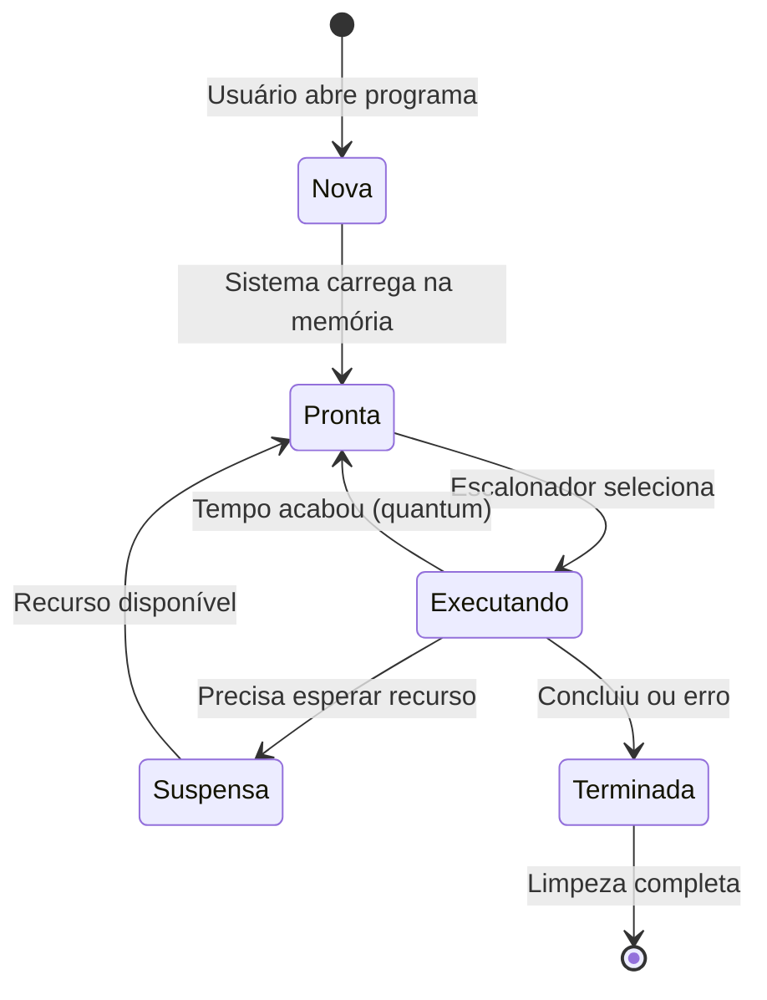

# 📋 Conceito de Tarefa 

## 🧩 Introdução  
Um sistema de computação precisa lidar com mais tarefas do que processadores disponíveis. Isso exige:  
- **Multiplexação do processador** 🎛️: Compartilhar o uso do CPU entre tarefas.  
- **Estratégias de priorização** ⚖️: Alocar recursos de forma equilibrada.  

**Analogia:** Imagine um chef de cozinha (CPU) que precisa preparar vários pratos (tarefas) ao mesmo tempo, mas só tem uma boca do fogão (núcleo do processador). Ele precisa alternar entre os pratos para que nenhum queime!  

 

## 📌 O Conceito de Tarefa  
**Técnico:**  
- **Tarefa (Task):** Fluxo sequencial de instruções executadas para um propósito específico (ex.: calcular, editar um arquivo).  
- **Programa vs. Tarefa:**  
  - **Programa** 📜: Código estático (ex.: arquivo `notepad.exe`).  
  - **Tarefa** 🔄: Instância dinâmica em execução, com estado interno (valores de variáveis, posição atual no código).  

**Analogia:**  
- **Programa = Receita de bolo** (passos escritos).  
- **Tarefa = Atividade de fazer o bolo** (mexer a massa, assar, decorar).  

### 🌟 Exemplo Prático  
Um navegador Web executa múltiplas tarefas simultaneamente:  
1. 🕸️ Buscar dados da rede.  
2. 🖥️ Renderizar HTML.  
3. 🎨 Animar elementos.  
4. 🖱️ Responder a cliques do usuário.  

 

## ⚙️ Gerência de Tarefas
O processador precisa executar **todas as tarefas** dos usuários, mas como elas têm:
  - Comportamentos diferentes (algumas usam mais CPU, outras esperam por E/S)
  - Durações variadas (tarefas curtas vs. longas)
  - Importâncias distintas (sistema vs. usuário)

**Solução:** O sistema operacional age como um gerente inteligente, decidindo:
  - Qual tarefa executar agora (escalonamento)
  - Por quanto tempo (quantum)
  - Como alternar entre elas (preempção) 

 

### 📜 Sistemas Monotarefa (Anos 40)  
**Definição Técnica:**  
Primeiros sistemas executavam **uma tarefa por vez**, com carga manual de programas e dados via operador humano.  

**Problema:**  
CPU ficava ociosa durante operações de E/S (ex.: ler dados do disco), desperdiçando recursos.  

**Analogia:**  
Como um caixa de banco que atende **uma pessoa por vez** e fica parado enquanto ela conta dinheiro manualmente.  

 

### 🖥️ Monitor de Sistema  
**Definição Técnica:**  
Programa residente na memória para gerenciar filas de tarefas, automatizando carga/descarga de programas e oferecendo bibliotecas para E/S.  

**Melhoria:**  
Reduziu tempo perdido com operações manuais, mas ainda havia ociosidade do CPU durante E/S lentas (ex.: fitas magnéticas).  

**Analogia:**  
Um **chefe de cozinha** que organiza pedidos em uma fila, mas ainda precisa esperar o forno assar cada prato antes de começar o próximo.  

 

### 🔄 Sistemas Multitarefa  
**Definição Técnica:**  
Introduziu a **suspensão de tarefas** durante E/S, permitindo que o CPU execute outras tarefas enquanto aguarda dados externos.  

**Mecanismo:**  
Rotinas de E/S padronizadas pelo monitor suspendiam tarefas e retomavam depois.  

**Exemplo:**  
Tarefa A lê um arquivo → é suspensa → Tarefa B usa o CPU → Tarefa A retoma quando o arquivo está pronto para leitura.  

**Analogia:**  
Um garçom que **anota pedidos** (suspende tarefas) e serve outras mesas (CPU) enquanto a cozinha prepara os pratos (E/S).  

 

### ⏳ Sistemas de Time-Sharing (CTSS)  
**Definição Técnica:**  
Dividiu o CPU em quantums (fatias de tempo), usando preempção por temporizador para evitar monopolização.  

**Inovação:** 
- **Quantums:** Pedaços de tempo fixos por tarefa (ex: 100ms) 
- **Preempção:** Interrupção forçada da tarefa ao esgotar seu quantum.  
- **Ticks:** Interrupções periódicas do hardware (ex.: a cada 1ms) para controlar o tempo.  

**Impacto:**  
Permitiu sistemas interativos (ex.: terminais de comando), onde tarefas não precisam esperar E/S para liberar o CPU.  

**Analogia:**  
Um **jogo de revezamento** onde cada corredor (tarefa) tem exatos 10 segundos (quantum) para correr antes de passar o bastão.  

 

## 🔄 Ciclo de Vida das Tarefas

### 📊 Estados das Tarefas

| Estado             | O Que Acontece?                                                  | Exemplo Prático                     |
|--------------------|------------------------------------------------------------------|-------------------------------------|
| 🆕 **Nova**       | A tarefa acabou de ser criada e está sendo preparada para rodar. | Quando você abre um novo programa   |
| 🕒 **Pronta**     | A tarefa está na fila, esperando sua vez de usar o CPU.          | Programa carregado mas não rodando  |
| ⚡ **Executando** | A tarefa está **usando o CPU** neste exato momento.              | Programa aberto e funcionando       |
| 🛑 **Suspensa**   | A tarefa está esperando por algo (dados do disco, rede, etc.).   | Programa travado esperando download |
| 🏁 **Terminada**  | A tarefa finalizou (ou foi abortada) e está liberando recursos.  | Quando você fecha um programa       |

 

### 🔄 Diagrama de Fluxo 

 

### 🔄 Explicação das Transições

#### [*] → Nova
**Quando acontece:** Quando você clica em um programa  
**O que ocorre:** O sistema operacional cria uma nova tarefa  
📌 **Exemplo:** Abrir o navegador pela primeira vez  

#### Nova → Pronta
**Quando acontece:** Após a criação da tarefa  
**O que ocorre:** O SO carrega o programa na memória e o coloca na fila de espera  
📌 **Exemplo:** Navegador já carregou na memória, mas ainda não começou a executar  

#### Pronta → Executando
**Quando acontece:** Quando chega sua vez na fila  
**O que ocorre:** O escalonador seleciona a tarefa para usar o CPU  
📌 **Exemplo:** O navegador finalmente abre e mostra a página inicial  

#### Executando → Pronta
**Quando acontece:** Ao esgotar o tempo de CPU (quantum)  
**O que ocorre:** A tarefa volta para o final da fila de prontas  
📌 **Exemplo:** Navegador executou por 20ms e agora dá vez ao player de música  

#### Executando → Suspensa
**Quando acontece:** Quando precisa esperar por um recurso  
**O que ocorre:** A tarefa é pausada até o recurso ficar disponível  
📌 **Exemplo:** Navegador esperando carregar uma imagem pesada da internet  

#### Suspensa → Pronta
**Quando acontece:** Quando o recurso solicitado fica disponível  
**O que ocorre:** A tarefa volta para a fila de prontas  
📌 **Exemplo:** Imagem finalmente carregou e o navegador pode continuar  

#### Executando → Terminada
**Quando acontece:** Quando finaliza normalmente ou por erro  
**O que ocorre:** O processo é encerrado  
📌 **Exemplo:** Você fechou o navegador ou ele travou com um erro  

#### Terminada → [*]
**Quando acontece:** Após o término  
**O que ocorre:** O SO libera todos os recursos alocados  
📌 **Exemplo:** Como um garçom limpando a mesa após o cliente sair  

 

## ❓ **Exercícios com Respostas**

### 1. **Qual a diferença entre programa e tarefa?**  
**Resposta:**  
- 📜 **Programa**: Código estático armazenado no disco (ex: `chrome.exe`)  
- 🔄 **Tarefa**: Instância em execução do programa, com estado dinâmico (valores de variáveis, posição no código)

### 2. **Por que os primeiros sistemas monotarefa eram ineficientes?**  
**Resposta:**  
A CPU ficava ociosa durante operações lentas (ex: ler disco), pois só executava uma tarefa por vez.

### 3. **Como o Monitor de Sistema melhorou o gerenciamento?**  
**Resposta:**  
Automatizou a troca de tarefas via fila, mas ainda tinha ociosidade durante E/S.  
**Mecanismo:** Programa "chefe" que gerenciava carga/descarga de outras tarefas.

### 4. **Qual o grande avanço dos sistemas multitarefa?**  
**Resposta:**  
Permitiu suspender tarefas em E/S e executar outras, eliminando ociosidade.

### 5. **O que é time-sharing e como funciona?**  
**Resposta:**  
- ⏳ **Time-sharing**: Divisão do CPU em fatias de tempo (quantums)  
- ⚙️ **Funcionamento**: Timer interrompe tarefas periodicamente (ticks) para alterná-las

### 6. **Por que a preempção é importante?**  
**Resposta:**  
Evita que uma tarefa monopolize o CPU indefinidamente (ex: loops infinitos).

### 7. **Quais são os 5 estados de uma tarefa?**  
**Resposta:**  
1. 🆕 Nova  
2. 🕒 Pronta  
3. ⚡ Executando  
4. 🛑 Suspensa  
5. 🏁 Terminada

### 8. **Quando uma tarefa vai para o estado "Suspensa"?**  
**Resposta:**  
Quando precisa esperar por:  
- 📁 E/S (disco/rede)  
- ⏱️ Temporizadores (sleep)  
- 🤝 Sincronização (ex: esperar outra tarefa) 

### 9. **Como o quantum afeta a performance do sistema?**  
**Resposta:**  
- Quantum **curto**: Melhor para apps interativos (mais trocas)  
- Quantum **longo**: Melhor para tarefas CPU-intensive (menos overhead)  
**Padrão:** 10-200ms na maioria dos SOs.

### 10. **Por que a maioria das tarefas fica em estado "Suspensa"?**  
**Resposta:**  
Porque apps modernos passam mais tempo esperando por:  
- 🌐 Rede  
- 🖥️ Input do usuário  
- 💾 Acesso a disco 